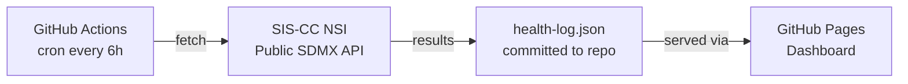

# statpulse

[](https://github.com/erenkahraman/statpulse.github.io/actions/workflows/health-check.yml)
[](https://erenkahraman.github.io/statpulse.github.io)
[](LICENSE)

**Real-time API health monitoring for the SIS-CC .Stat Suite SDMX platform.**

## What is this?

We built statpulse to demonstrate production-grade platform observability skills in the context of the SIS-CC .Stat Suite — the open-source SDMX dissemination platform that powers OECD's Data Explorer, country NSIs, and international statistical organisations.

Every six hours, a GitHub Actions workflow calls three public, auth-free SDMX REST API endpoints on the SIS-CC demo environment. The results — HTTP status, response time, content-type validity, and domain-specific metrics like DSD catalogue size — are committed back to this repository as `data/health-log.json`. A self-contained GitHub Pages dashboard reads that file directly and renders uptime percentages, response-time charts, and data quality trends.

No backend. No database. No cloud bill.

This is also a portfolio project for an OECD SDD/SDPS Product Manager role — it demonstrates hands-on familiarity with SDMX artefacts, the .Stat Suite module architecture, GSBPM-aligned data lifecycle thinking, and the kind of automated governance tooling a PM should be able to commission and own.

## Architecture



## Monitored Endpoints

| Endpoint | URL | What we measure |
|---|---|---|
| Structures | `https://nsi-demo-stable.siscc.org/rest/datastructure/all/all/all?detail=allstubs` | Uptime, response time, DSD catalogue count |
| Data Query | `https://nsi-demo-stable.siscc.org/rest/data/OECD.CFE,INBOUND@TOURISM_TRIPS,2.0` | Uptime, response time, response size KB |
| Codelists | `https://nsi-demo-stable.siscc.org/rest/codelist/all/all/latest?detail=allstubs` | Uptime, response time, Codelist catalogue count |

All three endpoints are public and require no authentication — they represent the live SIS-CC demo environment.

## Product Management Layer

The `governance/` directory contains the artefacts a PM owns alongside the code:

| File | Purpose |
|---|---|
| `governance/kpis.yaml` | Six measurable KPIs tied to platform reliability, data quality, accessibility, and community health |
| `governance/dsd-audit-checklist.md` | Pre-promotion checklist for SDMX Data Structure Definitions |
| `governance/data-lifecycle.md` | GSBPM-aligned end-to-end data lifecycle with Mermaid flowchart |

Issue templates in `.github/ISSUE_TEMPLATE/` cover user stories, SDMX artefact change requests, and API health alerts.

## KPIs Tracked

| KPI | Target | Frequency |
|---|---|---|
| API Availability | ≥ 99.5% | Every 6h |
| API Response Time (p95) | < 3000ms | Every 6h |
| SDMX Content-Type Validity | 100% | Every 6h |
| DataStructure Catalogue Stability | ±5 of 30-day rolling avg | Daily |
| Dashboard WCAG 2.1 AA | Zero critical violations | Per PR |
| Community Issue Resolution | Bugs < 30d, Features < 90d | Monthly |

## Local Development

```bash
# Clone the repository
git clone https://github.com/erenkahraman/statpulse.git
cd statpulse

# No runtime dependencies — Node 20 built-in fetch handles everything
npm install

# Run a health check manually and populate health-log.json
npm run check

# Preview the dashboard locally (copy data file alongside HTML)
cp data/health-log.json dashboard/health-log.json
# Open dashboard/index.html in your browser
open dashboard/index.html
```

Node.js 20 or later is required. The script uses the built-in `fetch` API — no `node-fetch` or other HTTP libraries needed.

## About .Stat Suite

[.Stat Suite](https://sis-cc.gitlab.io/dotstatsuite-documentation/) is the SIS-CC open-source platform for statistical data dissemination. It implements the SDMX standard and consists of several modules:

- **.Stat Core** — the NSI (National Statistics Institute) component that exposes the SDMX REST API
- **Data Lifecycle Manager (DLM)** — governance UI for creating and versioning SDMX artefacts
- **Data Explorer (SDE)** — end-user data discovery and download interface
- **Search & Facet Service (SFS)** — indexing and faceted search engine

statpulse monitors the .Stat Core REST API layer, which is the shared foundation all other modules depend on.

## Contributing

We welcome issues, ideas, and pull requests. Use the issue templates in `.github/ISSUE_TEMPLATE/` to structure requests — the API health alert template is especially useful if you spot a monitoring gap.

## Changelog

### v1.0.0 — 2025

- Initial release: three-endpoint SDMX monitoring via GitHub Actions
- Self-contained GitHub Pages dashboard with Chart.js response-time visualisation
- Governance layer: KPI framework, DSD audit checklist, GSBPM lifecycle diagram
- Issue templates for user stories, SDMX artefact changes, and health alerts

---

*Built as a portfolio project for OECD SDD/SDPS PM role | Not officially affiliated with OECD or SIS-CC*
