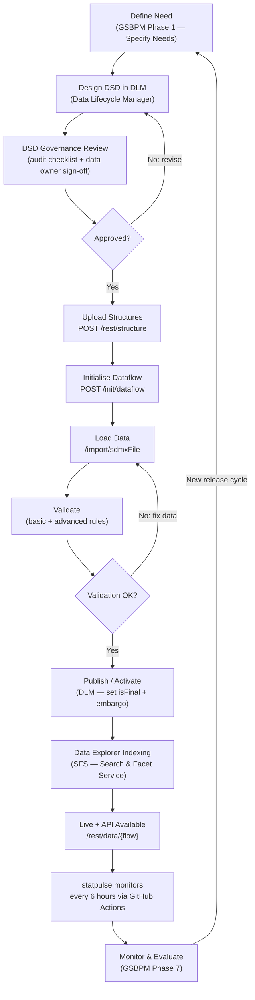

# .Stat Suite Data Lifecycle — GSBPM-Aligned Process Flow

This document maps the end-to-end journey of a statistical dataset through the
SIS-CC .Stat Suite platform, from initial need identification to ongoing live
monitoring. Each stage is aligned to the Generic Statistical Business Process
Model (GSBPM v5.1) to support international comparability and audit trail.

---

## Process Diagram

---

## Phase Descriptions

### Specification and Design (GSBPM Phases 1–2)

The lifecycle begins when a data owner or statistical team identifies a reporting
need — typically driven by a mandate (e.g. OECD Tourism Statistics mandate),
a new data provider agreement, or a revision to an existing methodology. The
Product Manager captures the requirement as a user story (see
`.github/ISSUE_TEMPLATE/user-story.md`) and works with the data governance team
to design the Data Structure Definition (DSD) inside the **Data Lifecycle Manager
(DLM)** module. DLM provides a visual interface for defining dimensions, codelists,
concept schemes, and attributes without requiring direct XML authoring. Every
structural change goes through the DSD audit checklist (`governance/dsd-audit-checklist.md`)
before it can proceed — this gate enforces bilingual metadata, semantic versioning,
and dependency verification against the target data space.

### Build and Collect (GSBPM Phases 3–4)

Once the DSD is approved, structures are published to the NSI via a
`POST /rest/structure` call, and the dataflow is registered using the proprietary
`/init/dataflow` endpoint that .Stat Suite exposes alongside the standard SDMX
REST API. Data files (in SDMX-ML, SDMX-CSV, or flat-file format) are ingested
through `/import/sdmxFile`. The NSI applies two layers of validation: **basic
validation** checks structural conformance (correct dimensions, valid codelist
codes, mandatory attributes present) and **advanced validation** applies any
custom business rules configured in DLM (e.g. value range constraints, cross-dataset
consistency checks). Files that fail either layer are rejected with a structured
error report — the data provider must correct and resubmit.

### Dissemination and Evaluation (GSBPM Phases 6–7)

After successful validation the data owner activates the dataflow in DLM, which
sets `isFinal="true"` on the relevant artefacts and applies any configured embargo
settings. The **Search & Facet Service (SFS)** indexes the new dataset so it
appears in Data Explorer faceted search. Within minutes the data is accessible via
the standard SDMX REST API at `/rest/data/{agencyID},{flowID}@{DSDid},{version}`.
From this point **statpulse** takes over the monitoring role: every six hours
GitHub Actions calls the three representative endpoints, records uptime, response
time, content-type validity, and catalogue-size metrics into `data/health-log.json`,
and the dashboard at `https://erenkahraman.github.io/statpulse.github.io` surfaces those
metrics in real time. Anomalies detected by statpulse feed back into Phase 7
(Monitor & Evaluate) and trigger a new iteration of the lifecycle if structural
or data corrections are required.
